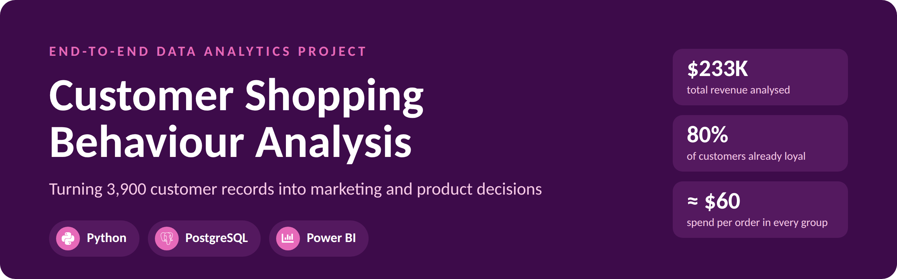
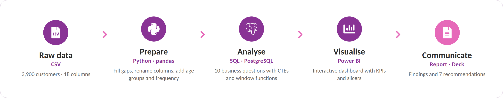
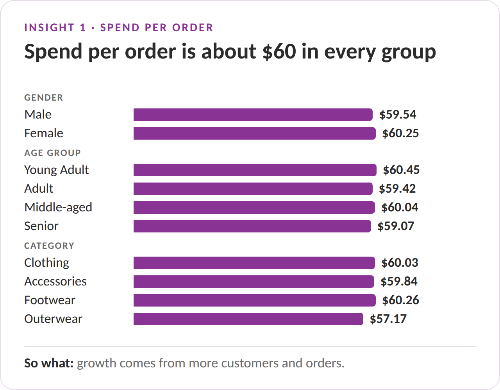
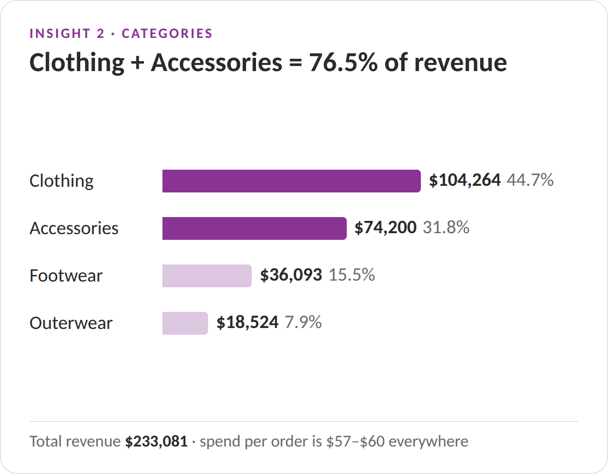
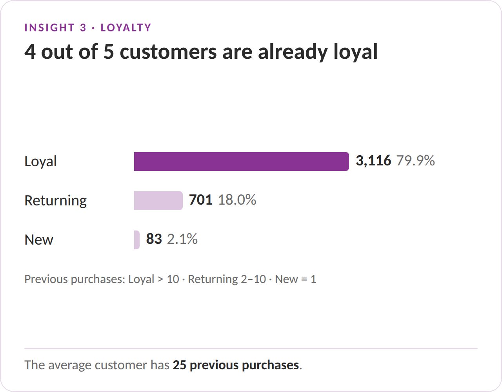
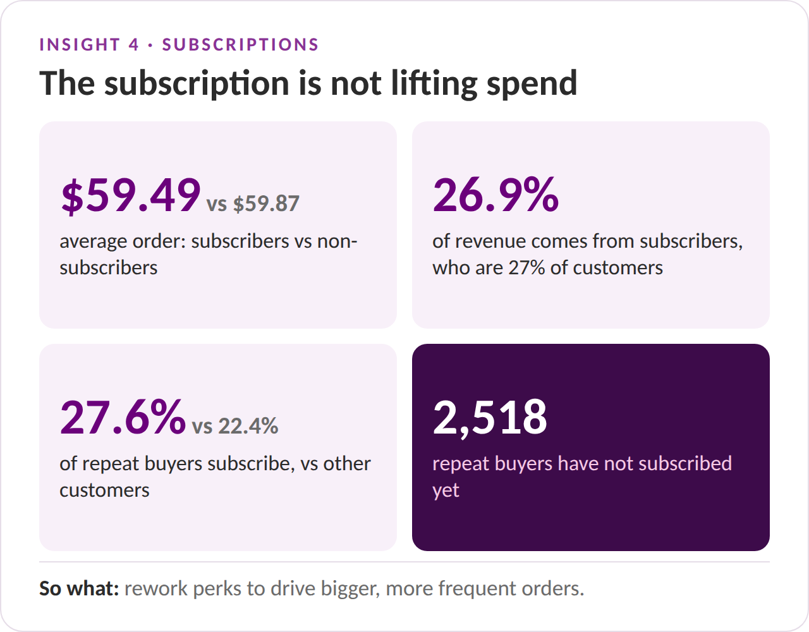
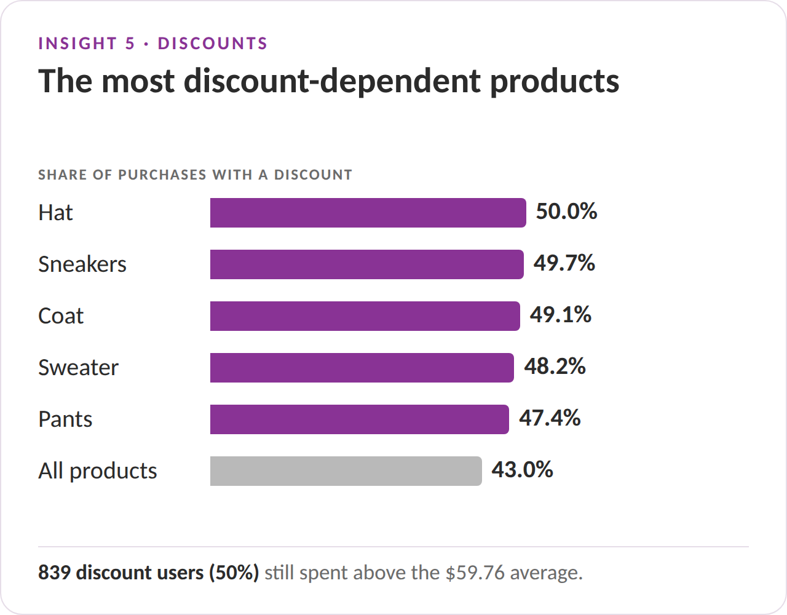
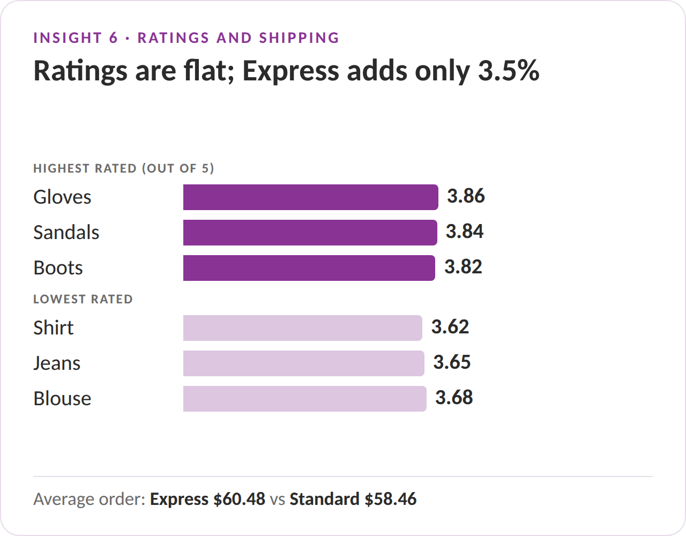
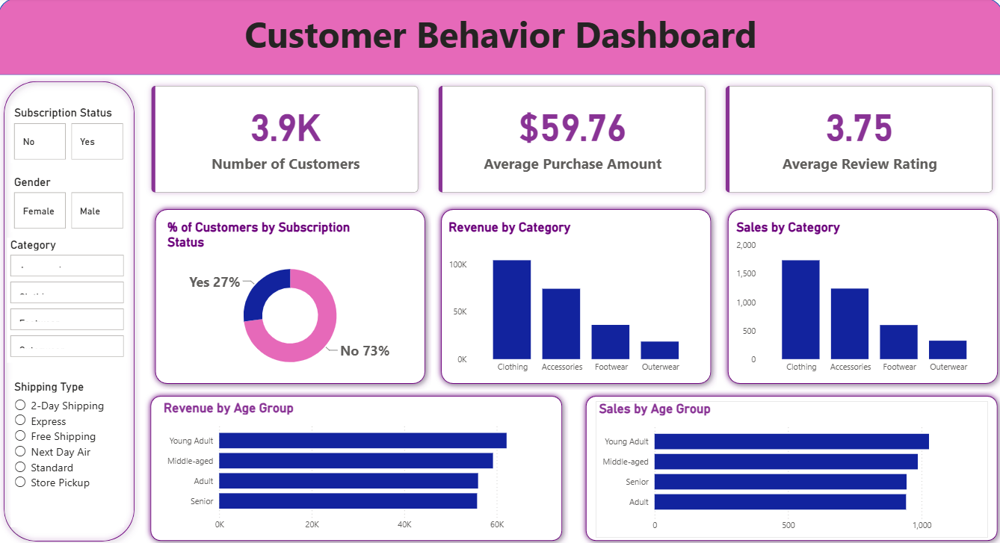

<p align="center">
  
</p>

<p align="center">
  
  
  
  
</p>

<p align="center">
  <a href="reports/Customer_Shopping_Behaviour_Report.pdf"><b>Project Report</b></a> ·
  <a href="reports/Customer_Shopping_Behaviour_Presentation.pdf"><b>Presentation</b></a> ·
  <a href="#dashboard"><b>Dashboard</b></a> ·
  <a href="sql/customer_behaviour_sql_queries.sql"><b>SQL Queries</b></a> ·
  <a href="notebooks/Customer_Shopping_Behaviour_Analysis.ipynb"><b>Python Notebook</b></a>
</p>

---

## Contents

1. [Project overview](#project-overview)
2. [Workflow](#workflow)
3. [Key insights](#key-insights)
4. [Dashboard](#dashboard)
5. [Business recommendations](#business-recommendations)
6. [Methodology](#methodology)
7. [Repository structure](#repository-structure)
8. [How to reproduce](#how-to-reproduce)
9. [Skills demonstrated](#skills-demonstrated)
10. [Limitations and next steps](#limitations-and-next-steps)
11. [Dataset](#dataset)
12. [Author](#author)

---

## Project overview

A retail company wants to understand how its customers shop so it can improve sales, customer satisfaction and long-term loyalty. Management has noticed changes in buying patterns across demographics and product categories, and wants to know which factors, such as discounts, reviews and shipping, drive purchases and repeat purchases.

This project takes a dataset of **3,900 customers** through the full analytics workflow: cleaning in **Python**, answering business questions in **SQL**, building an interactive **Power BI** dashboard, and presenting the results in a written report and a stakeholder deck.

> **Business question**
>
> *How can the company leverage consumer shopping data to identify trends, improve customer engagement, and optimize marketing and product strategies?*

### At a glance

| Customers | Total revenue | Average purchase | Average rating | SQL questions | Recommendations |
| :---: | :---: | :---: | :---: | :---: | :---: |
| **3,900** | **$233,081** | **$59.76** | **3.75 / 5** | **10** | **7** |

---

## Workflow

<p align="center">
  
</p>

| Stage | Tool | Output |
| --- | --- | --- |
| 1. Data preparation | Python (pandas, SQLAlchemy) | [Cleaned table loaded into PostgreSQL](notebooks/Customer_Shopping_Behaviour_Analysis.ipynb) |
| 2. Data analysis | SQL (PostgreSQL) | [10 business questions answered](sql/customer_behaviour_sql_queries.sql) |
| 3. Visualisation | Power BI | [Interactive dashboard](dashboard/customer_behaviour_dashboard.pbix) |
| 4. Communication | Word, PowerPoint | [Project report](reports/Customer_Shopping_Behaviour_Report.pdf) and [presentation](reports/Customer_Shopping_Behaviour_Presentation.pdf) |

---

## Key insights

> **The bottom line:** revenue grows with more loyal customers and bigger baskets, not deeper discounts.

<table>
  <tr>
    <td width="50%"></td>
    <td width="50%"></td>
  </tr>
  <tr>
    <td width="50%"></td>
    <td width="50%"></td>
  </tr>
  <tr>
    <td width="50%"></td>
    <td width="50%"></td>
  </tr>
</table>

| # | Finding | Evidence |
| :---: | --- | --- |
| 1 | **Revenue follows customer volume, not spend per order** | Average purchase stays between $57 and $61 across gender, age group, category, shipping type and subscription status |
| 2 | **Clothing and Accessories drive the business** | 76.5% of revenue: Clothing $104,264, Accessories $74,200 |
| 3 | **Most customers are already loyal** | 3,116 customers (79.9%) have more than 10 previous purchases; the average is 25 |
| 4 | **Subscriptions are not lifting spend** | Subscribers average $59.49 per order vs $59.87; 2,518 repeat buyers have not subscribed |
| 5 | **Discounts are common, but not only for low spenders** | 43% of purchases use a discount; 839 of those customers (50%) still spend above average |
| 6 | **Ratings are average across the board** | Every product averages between 3.62 and 3.86 (overall 3.75) |
| 7 | **Faster shipping is linked to slightly higher spend** | Express $60.48 vs Standard $58.46 per order (+3.5%) |
| 8 | **Young Adults contribute the most revenue** | 26.7% of revenue, but all four age groups are within about $6,400 |

---

## Dashboard

<p align="center">
  
</p>

The [Power BI dashboard](dashboard/customer_behaviour_dashboard.pbix) connects to the cleaned `customer` table in PostgreSQL.

| Element | Contents |
| --- | --- |
| **KPI cards** | Number of customers (3.9K), average purchase amount ($59.76), average review rating (3.75) |
| **Charts** | Customers by subscription status, revenue and orders by category, revenue and orders by age group |
| **Slicers** | Subscription status, gender, category, shipping type |
| **DAX measures** | `COUNT(customer_id)`, `AVERAGE(purchase_amount)`, `AVERAGE(review_rating)` |

---

## Business recommendations

| # | Recommendation | Suggested actions | Based on |
| :---: | --- | --- | :---: |
| 1 | **Rework subscription benefits** | Add perks that encourage bigger or more frequent orders, such as free express shipping or member-only bundles, and target the 2,518 repeat buyers who have not subscribed | Findings 4, 7 |
| 2 | **Reward loyal customers** | Create a tiered loyalty programme for the 3,116 Loyal customers, with tiers based on previous purchases | Finding 3 |
| 3 | **Review the discount strategy** | Check margins on Hat, Sneakers, Coat, Sweater and Pants, test smaller or targeted discounts, and offer premium deals to the 839 high-spending discount users | Finding 5 |
| 4 | **Grow average order value** | Use bundles, cross-selling and free-shipping thresholds to increase basket size | Finding 1 |
| 5 | **Strengthen core categories** | Keep Clothing and Accessories prominent, and grow Footwear and Outerwear through bundles with core items | Finding 2 |
| 6 | **Improve product satisfaction** | Act on feedback for the lowest-rated items (Shirt, Jeans, Blouse) and feature the top-rated Gloves, Sandals and Boots | Finding 6 |
| 7 | **Target campaigns by age** | Tailor campaigns for Young Adults while keeping messaging broad, since all age groups contribute similarly | Finding 8 |

---

## Methodology

### 1. Data preparation (Python)

The [notebook](notebooks/Customer_Shopping_Behaviour_Analysis.ipynb) cleans the raw data and loads it into PostgreSQL.

| Step | What was done |
| --- | --- |
| Explore | Checked structure, data types and summary statistics with `df.info()` and `df.describe()` |
| Handle missing values | Filled the 37 missing review ratings with the **median rating of the same category** |
| Standardise names | Converted column names to `snake_case` and renamed `Purchase Amount (USD)` to `purchase_amount` |
| Add `age_group` | Split ages into four equal-sized groups with `pd.qcut`: Young Adult (18–31), Adult (32–44), Middle-aged (45–57), Senior (58–70) |
| Add `purchase_frequency_days` | Mapped frequency labels to days (Weekly = 7 … Annually = 365) |
| Remove redundancy | Confirmed `promo_code_used` matched `discount_applied` in all rows, then dropped it |
| Load | Wrote the clean table (3,900 rows × 19 columns) to PostgreSQL with SQLAlchemy |

```python
# Fill each missing rating with the median rating of the same category
df['Review Rating'] = df.groupby('Category')['Review Rating'].transform(
    lambda x: x.fillna(x.median())
)
```

### 2. SQL analysis (PostgreSQL)

The [SQL file](sql/customer_behaviour_sql_queries.sql) answers ten business questions. Every query is commented and the whole file runs in one go.

| # | Business question | SQL techniques |
| :---: | --- | --- |
| Q1 | Revenue by gender | `GROUP BY`, `SUM` |
| Q2 | Discount users who still spent above average | Subquery in `WHERE` |
| Q3 | Top 5 products by average rating | `AVG`, type casting, `ORDER BY` + `LIMIT` |
| Q4 | Average purchase: Standard vs Express shipping | `IN` filter, `ROUND` |
| Q5 | Subscribers vs non-subscribers | Multiple aggregates |
| Q6 | Most discount-dependent products | `CASE WHEN` inside `SUM` |
| Q7 | New, Returning and Loyal segments | CTE, `CASE WHEN` |
| Q8 | Top 3 products in each category | CTE, `ROW_NUMBER() OVER (PARTITION BY …)` |
| Q9 | Do repeat buyers subscribe? | Window function over an aggregate |
| Q10 | Revenue by age group | `GROUP BY`, `ORDER BY` |

<details>
<summary><b>Example query: top 3 products in each category (Q8)</b></summary>

```sql
WITH item_counts AS (
    SELECT category,
           item_purchased,
           COUNT(customer_id) AS total_orders,
           ROW_NUMBER() OVER (
               PARTITION BY category
               ORDER BY COUNT(customer_id) DESC, item_purchased
           ) AS item_rank
    FROM customer
    GROUP BY category, item_purchased
)
SELECT item_rank,
       category,
       item_purchased,
       total_orders
FROM item_counts
WHERE item_rank <= 3
ORDER BY category, item_rank;
```

</details>

### 3. Dashboard and reporting

The Power BI dashboard turns the SQL findings into an interactive view for stakeholders. The results are written up in a [9-page report](reports/Customer_Shopping_Behaviour_Report.pdf) and a [15-slide presentation](reports/Customer_Shopping_Behaviour_Presentation.pdf) with speaker notes ([PowerPoint version](reports/Customer_Shopping_Behaviour_Presentation.pptx)).

---

## Repository structure

```
customer-shopping-behaviour-analysis/
├── README.md
├── requirements.txt
├── data/
│   └── customer_shopping_behavior.csv            # raw dataset (3,900 rows × 18 columns)
├── notebooks/
│   └── Customer_Shopping_Behaviour_Analysis.ipynb  # cleaning, feature engineering, load to PostgreSQL
├── sql/
│   └── customer_behaviour_sql_queries.sql        # 10 business questions
├── dashboard/
│   └── customer_behaviour_dashboard.pbix         # Power BI dashboard
├── reports/
│   ├── Customer_Shopping_Behaviour_Report.pdf
│   ├── Customer_Shopping_Behaviour_Presentation.pdf
│   └── Customer_Shopping_Behaviour_Presentation.pptx
└── images/                                       # README visuals and dashboard screenshot
```

---

## How to reproduce

**Requirements:** Python 3.10+, PostgreSQL with pgAdmin, and Power BI Desktop (Windows).

1. **Clone the repository**
   ```bash
   git clone https://github.com/AyushUmmadi/customer-shopping-behaviour-analysis.git
   cd customer-shopping-behaviour-analysis
   ```
2. **Install the Python libraries**
   ```bash
   pip install -r requirements.txt
   ```
3. **Create the database.** In pgAdmin, create a database named `customer_behaviour`.
4. **Run the notebook.** Open `notebooks/Customer_Shopping_Behaviour_Analysis.ipynb`, enter your PostgreSQL password in Section 8, and run all cells. This creates the `customer` table.
5. **Run the SQL.** Open `sql/customer_behaviour_sql_queries.sql` in the pgAdmin Query Tool and run it.
6. **Open the dashboard.** Open `dashboard/customer_behaviour_dashboard.pbix` in Power BI Desktop. If asked, sign in to your PostgreSQL server (`localhost:5432`, database `customer_behaviour`) and click **Refresh**.

---

## Skills demonstrated

| Area | What this project shows |
| --- | --- |
| **Data cleaning** | Group-wise median imputation, column standardisation, redundancy checks |
| **Feature engineering** | Quartile-based age groups, converting text labels into numbers |
| **SQL** | Aggregations, subqueries, CTEs, `CASE WHEN`, window functions (`ROW_NUMBER`, `SUM() OVER`) |
| **Data integration** | Loading a pandas DataFrame into PostgreSQL with SQLAlchemy |
| **Business intelligence** | Power BI KPI cards, DAX measures, interactive slicers |
| **Communication** | Written report, stakeholder presentation and actionable recommendations |
| **Analytical judgement** | Flagging dataset quirks and separating correlation from causation |

---

## Limitations and next steps

**Limitations**

- **Snapshot data:** each row is a customer's latest purchase with no dates, so trends over time can't be measured.
- **Dataset quirk:** no female customer is a subscriber or used a discount. This is most likely a feature of this sample dataset, so no gender-based conclusions are drawn about discounts or subscriptions.
- **Even distributions:** season, payment method, shipping type and size are spread almost evenly, which limits what these factors can explain.
- **Correlation, not causation:** for example, higher spend with Express shipping is a relationship, not proof of cause.

**Next steps**

- Add purchase dates to track trends and real repeat-purchase timing.
- A/B test discount levels on the most discount-dependent products.
- Build a model to predict which repeat buyers are likely to subscribe.
- Use RFM (recency, frequency, monetary value) segmentation once transaction history is available.

---

## Dataset

`data/customer_shopping_behavior.csv` was provided with the project brief: **3,900 rows** (one per customer, describing their latest purchase) and **18 columns**.

<details>
<summary><b>Column dictionary</b></summary>

| Column | Description |
| --- | --- |
| Customer ID | Unique customer identifier |
| Age | Customer age (18–70) |
| Gender | Male or Female |
| Item Purchased | Product bought (25 products) |
| Category | Clothing, Accessories, Footwear or Outerwear |
| Purchase Amount (USD) | Value of the purchase ($20–$100) |
| Location | US state (all 50) |
| Size | S, M, L or XL |
| Color | Product colour (25 colours) |
| Season | Spring, Summer, Fall or Winter |
| Review Rating | Customer rating from 2.5 to 5.0 (37 missing) |
| Subscription Status | Whether the customer is subscribed (Yes/No) |
| Shipping Type | Express, Standard, Free Shipping, Next Day Air, 2-Day Shipping or Store Pickup |
| Discount Applied | Whether a discount was used (Yes/No) |
| Promo Code Used | Whether a promo code was used (identical to Discount Applied; dropped during cleaning) |
| Previous Purchases | Number of earlier purchases (1–50) |
| Payment Method | PayPal, Credit Card, Cash, Debit Card, Venmo or Bank Transfer |
| Frequency of Purchases | How often the customer buys, from Weekly to Annually |

</details>

---

## Author

**Ayush Ummadi**, Data Analyst

[](https://github.com/AyushUmmadi)
[](https://www.linkedin.com/in/ayush-ummadi)
